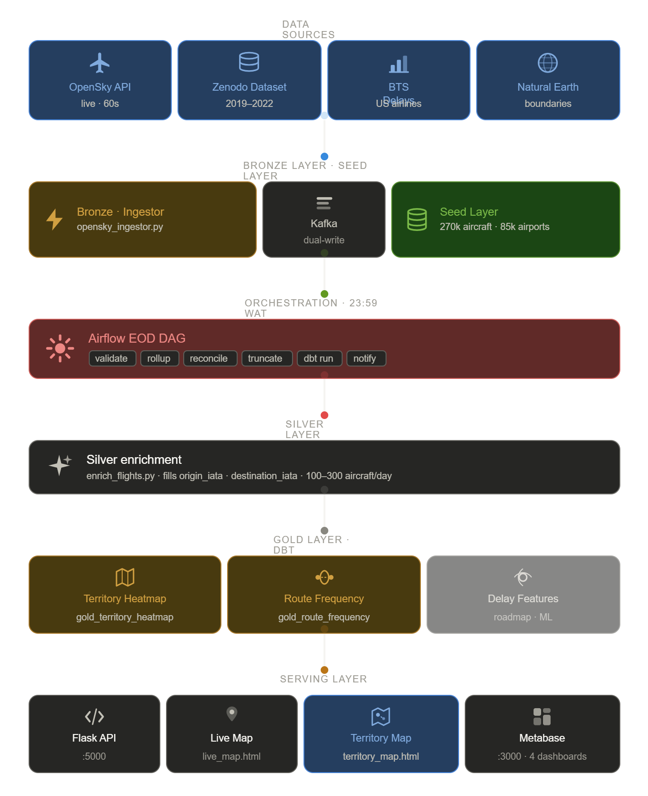
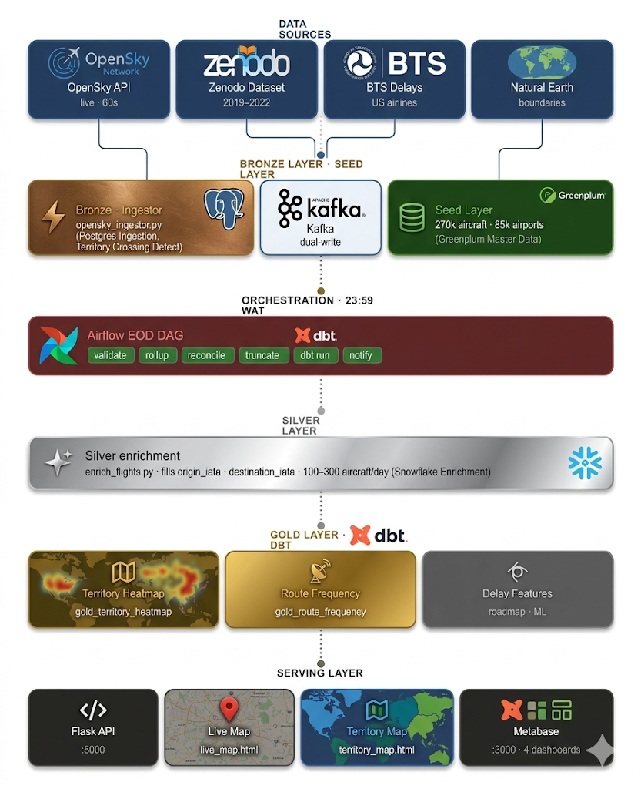
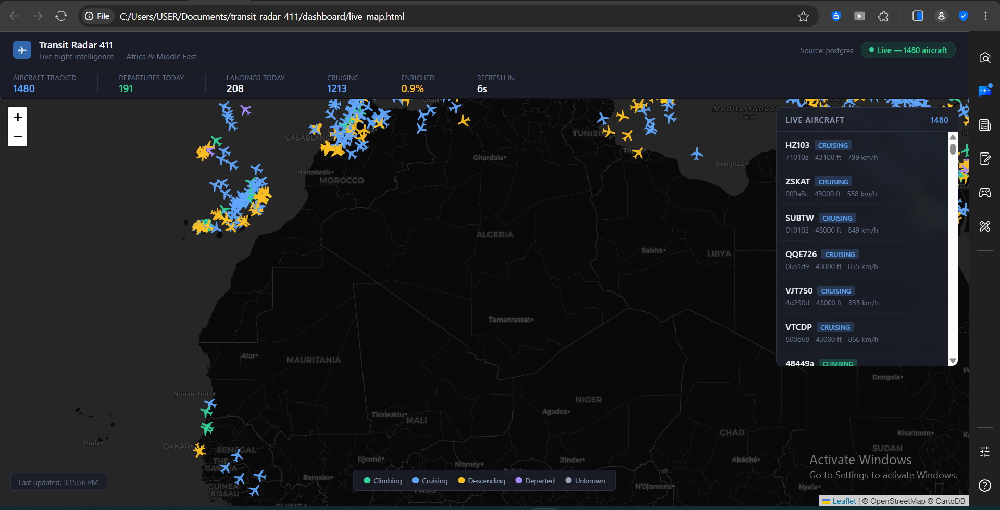
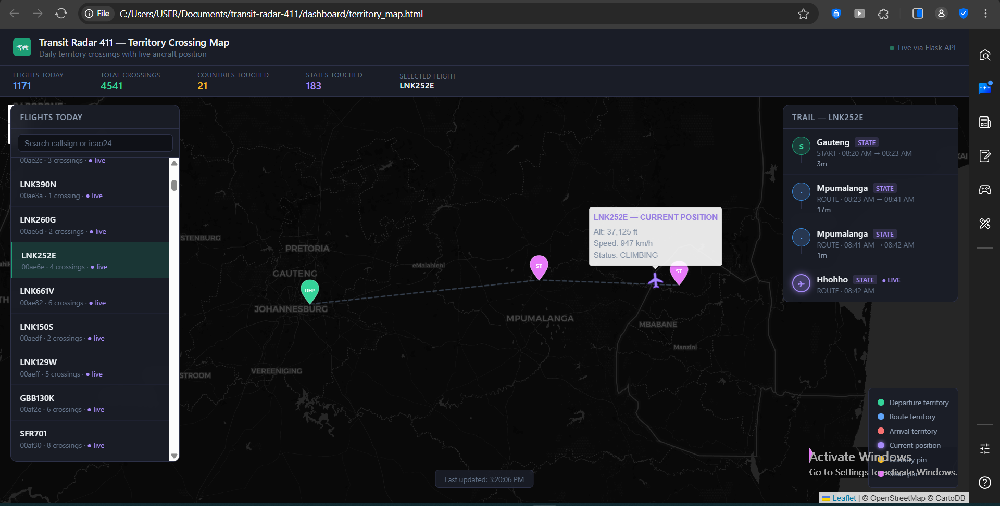

# Transit Radar 411 ✈️

> *A real-time data engineering pipeline that ingests live aircraft position data, detects meaningful flight state changes, tracks territory crossings using PostGIS spatial queries, and serves live dashboards and a territory crossing map — architected to mirror a fintech transaction processing system.*

**GitHub:** [Cassyeh/transit-radar-411](https://github.com/Cassyeh/transit-radar-411) | **Built:** March – April 2026 | **Budget:** $0


---


https://github.com/user-attachments/assets/ab0b373d-9295-4dc9-a10d-5de8aaafe65f


https://github.com/user-attachments/assets/2261eb27-acd5-4f24-a0c6-064ee2c74adf


## Table of Contents

1. [Project Overview & Business Requirements](#1-project-overview--business-requirements)
2. [Architecture Diagram](#2-architecture-diagram)
3. [Tech Stack](#3-tech-stack)
4. [Data Sources](#4-data-sources)
5. [Pipeline Workflow](#5-pipeline-workflow-step-by-step)
6. [Project Structure](#6-project-structure)
7. [Setup Instructions](#7-setup-instructions)
8. [Data Modeling & Key Tables](#8-data-modeling--key-tables)
9. [Data Quality & Testing](#9-data-quality--testing)
10. [Sample Queries & Insights](#10-sample-queries--insights)
11. [Use Cases](#11-use-cases)
12. [Orchestration & Scheduling](#12-orchestration--scheduling)
13. [Monitoring & Logging](#13-monitoring--logging)
14. [Challenges & Design Decisions](#14-challenges--design-decisions)
15. [Future Improvements / Roadmap](#15-future-improvements--roadmap)
16. [Acknowledgements](#16-acknowledgements)
17. [Contact](#17-contact)

---

## 1. Project Overview & Business Requirements

### What Is Transit Radar 411?

Transit Radar 411 is a production-grade real-time data engineering pipeline that ingests live ADS-B (Automatic Dependent Surveillance–Broadcast) flight data from the OpenSky Network API every 60 seconds, processes it through a Bronze → Silver → Gold medallion architecture, and surfaces insights through live dashboards and a territory crossing map.

The architecture deliberately mirrors a **fintech transaction processing system**. Every design decision was made by asking: *"How would a bank build this?"*
sidenote: I currently work in a bank

| Aviation concept | Banking equivalent |
|---|---|
| `icao24` (aircraft hex code) | `account_number` |
| `daily_flight_events` | `daily_transactions` |
| `hist_flight_events` | `hist_transactions` |
| EOD Airflow DAG at 23:59 WAT | Nightly batch settlement |
| Territory crossings | Geographic transaction origin |
| Kafka dual-write | Real-time event streaming |
| Silver enrichment | Transaction enrichment / KYC |
| dbt Gold models | Reporting aggregates |

This analogy is not cosmetic. It reflects a genuine architectural equivalence: the same patterns that power real-time fraud detection, nightly settlement, and transaction enrichment in financial systems are the patterns powering this pipeline. The domain is aviation. The engineering is fintech.

---

### Business Requirements

The following requirements drove every architectural decision in this project:

**BR-1: Real-time ingestion**
The system must ingest live aircraft position data at regular intervals (≤ 60 seconds) and detect meaningful state changes — DEPARTED, CLIMBING, CRUISING, DESCENDING, LANDED.

**BR-2: Historical retention**
All detected flight events must be retained indefinitely in a historical store. Daily working data must be separated from historical data to enable fast operational queries without scanning the full archive.

**BR-3: Territory awareness**
The system must detect when an aircraft crosses a country or state/province boundary and record the entry time, exit time, and duration. State-level resolution takes priority over country-level where available.

**BR-4: Route enrichment**
Each flight event must be enriched with origin and destination IATA airport codes where possible.

**BR-5: Nightly settlement**
A scheduled batch process must run at end-of-day to roll daily events into the historical store, reconcile counts, and notify the operator by email — mirroring the nightly settlement DAG used in payment processing.

**BR-6: Analytical dashboards**
Aggregated insights (busiest routes, most-crossed territories, flight trends) must be available for self-service analysis without querying raw tables directly.

**BR-7: Live map**
A live map must show current aircraft positions updating in real time.

**BR-8: Observability**
The system must send email notifications on pipeline start, completion, and failure. It must log all operations to rotating log files. A watchdog process must alert the operator if the nightly DAG fails to run.

---

### Minimum Viable Product

The MVP for this project was defined as:

- Live ingestor polling OpenSky API every 60 seconds, writing to PostgreSQL and Kafka
- All 11 database tables created and seeded with reference data
- Historical COVID-19 flight dataset (Jan 2019 – Dec 2022, ~216M rows) loaded
- EOD Airflow DAG running nightly: validate → rollup → reconcile → truncate → notify
- dbt Gold models building `gold_route_frequency` and `gold_territory_heatmap` post-rollup
- Flask API serving live positions to a Leaflet.js territory crossing map and a live states (DEPARTED/ARRIVED) map
- Metabase dashboards: Live Flight Monitor, Territory Heatmap, Route Frequency, Historical Overview
- Email notifications at DAG start, completion, and failure
- Watchdog DAG alerting on missed nightly runs, this has not been implemented yet 

The XGBoost delay prediction model (`ml/train_delay_model.py`) and `gold_delay_predictions` table are designed and scaffolded but not yet trained — intentionally deferred from the MVP scope.

---

## 2. Architecture Diagram



```
┌─────────────────────────────────────────────────────────────────────┐
│                        DATA SOURCES                                 │
│                                                                     │
│  OpenSky Network API          Zenodo COVID-19 Dataset               │
│  (live, every 60s)            (48 monthly files, 2019-2022)         │
│  opensky-network.org          zenodo.org/records/7923702            │
└───────────────┬───────────────────────────┬─────────────────────────┘
                │                           │
                ▼                           ▼
┌──────────────────────────┐   ┌────────────────────────────────────┐
│   BRONZE LAYER           │   │   SEED LAYER (one-time)            │
│                          │   │                                    │
│  opensky_ingestor.py     │   │  load_aircraft.py    270k rows     │
│  ├─ Detects state changes│   │  load_airports.py    85k rows      │
│  ├─ Writes flight events │   │  load_geodata.py     177 countries │
│  ├─ Detects territory    │   │  load_geodata_states.py 4,834 states│
│  │  crossings (PostGIS)  │   │  load_historical_states.py ~216M  │
│  └─ Dual-writes to:      │   │  load_bts_delays.py  US on-time   │
│     ├─ PostgreSQL        │   └────────────────────────────────────┘
│     │  daily_flight_events│
│     │  daily_territory_   │
│     │  crossings          │
│     └─ Kafka topic:      │
│        flight_events     │
└──────────────────────────┘
                │
                ▼
┌──────────────────────────────────────────────────────────────────┐
│   AIRFLOW EOD DAG  (23:59 WAT nightly)                           │
│                                                                  │
│   validate_daily_counts                                          │
│         ↓                                                        │
│   rollup_flight_events  →  hist_flight_events                    │
│         ↓                                                        │
│   rollup_territory_crossings  →  hist_territory_crossings        │
│         ↓                                                        │
│   reconcile_counts                                               │
│         ↓                                                        │
│   update_inflight_crossings                                      │
│         ↓                                                        │
│   truncate_daily_tables                                          │
│         ↓                                                        │
│   dbt_run  →  gold_route_frequency                               │
│            →  gold_territory_heatmap                             │
│         ↓                                                        │
│   send_completion_email                                          │
└──────────────────────────────────────────────────────────────────┘
                │
                ▼
┌──────────────────────────────────────────────────────────────────┐
│   SILVER LAYER                                                   │
│                                                                  │
│   enrich_flights.py                                              │
│   ├─ Calls OpenSky /flights/aircraft endpoint                    │
│   ├─ Fills origin_iata / destination_iata                        │
│   └─ 4,000 daily credits — 3s sleep between calls               │
└──────────────────────────────────────────────────────────────────┘
                │
                ▼
┌──────────────────────────────────────────────────────────────────┐
│   GOLD LAYER  (dbt)                                              │
│                                                                  │
│   gold_route_frequency      — busiest routes, pre-aggregated     │
│   gold_territory_heatmap    — crossings by territory             │
│   gold_delay_features       — ML feature store (scaffolded)      │
└──────────────────────────────────────────────────────────────────┘
                │
                ▼
┌──────────────────────────────────────────────────────────────────┐
│   SERVING LAYER                                                  │
│                                                                  │
│   Flask API  (port 5000)                                         │
│   ├─ /api/positions     — live aircraft positions                │
│   ├─ /api/crossings     — today's territory crossing trails      │
│   ├─ /api/stats         — summary counts                         │
│   └─ /api/health        — health check                           │
│                                                                  │
│   Leaflet.js Live Aircraft Map  (live_map.html)              │
│   └─ Real-time aircraft markers, auto-refreshes every 15s    │
│                                                              │
│   Leaflet.js Territory Crossing Map  (territory_map.html)    │
│   ├─ Flight selector panel — search by callsign or icao24    │
│   ├─ Full crossing trail per selected flight                 │
│   │  (green=departure, blue=route, red=arrival territory)    │
│   ├─ Live aircraft position with heading indicator           │
│   ├─ Stat bar: flights, crossings, countries, states touched │
│   └─ Auto-refreshes every 15 seconds                         │
│                                                                  │
│   Metabase Dashboards  (port 3000)                               │
│   ├─ Live Flight Monitor                                         │
│   ├─ Territory Heatmap                                           │
│   ├─ Route Frequency                                             │
│   └─ Historical Overview                                         │
└──────────────────────────────────────────────────────────────────┘
```

The final stage of the pipeline is the **serving layer** — two Leaflet.js maps and four Metabase dashboards. This is where raw ADS-B signals from aircraft at 35,000 feet become actionable intelligence. `live_map.html` shows where aircraft are right now. `territory_map.html` shows the full story — every country and state an aircraft crossed, when it entered, how long it stayed, and where it is at this moment.

---

## 3. Tech Stack

| Component | Technology | Version |
|---|---|---|
| Database | PostgreSQL + PostGIS | 15-3.4 |
| Orchestration | Apache Airflow | 2.8.0 |
| Message broker | Kafka + Zookeeper | Bitnami 3.5 |
| Dashboard | Metabase | 8.3 |
| DB admin | pgAdmin | 4 |
| Containerisation | Docker + Docker Compose | Latest |
| Language | Python | 3.11+ |
| Transformation | dbt-postgres | 1.7.0 |
| API | Flask + Flask-CORS | Latest |
| Live map | Leaflet.js | 1.9.4 |
| Spatial queries | PostGIS ST_Contains | 3.4 |
| ML model | XGBoost | Scaffolded — not yet trained |

---

## 4. Data Sources

| Source | URL | What it provides | Size |
|---|---|---|---|
| OpenSky aircraft DB | opensky-network.org | 520k aircraft records | ~50MB |
| OurAirports | davidmegginson.github.io | 85k airports worldwide | ~10MB |
| Natural Earth countries | naturalearthdata.com | Country boundaries (110m) | ~1MB |
| Natural Earth states | naturalearthdata.com | State/province boundaries (10m) | ~25MB |
| OpenSky COVID-19 dataset | zenodo.org/records/7923702 | 48 monthly flight files 2019–2022 | ~5–15GB |
| BTS on-time performance | transtats.bts.gov | US airline delays | Variable |
| OpenSky live API | opensky-network.org/api | Live aircraft positions every 60s | Real-time |
| OpenSky flights endpoint | opensky-network.org/api | Departure/arrival enrichment | Real-time |

OpenSky authentication uses OAuth2 client credentials flow. 4,000 API credits per day for the Silver enrichment layer.

---

## 5. Pipeline Workflow (Step-by-Step)

### Phase 1 — Continuous Live Ingestion

```
Every 60 seconds:
  1. opensky_ingestor.py polls OpenSky API (Africa + Middle East bounding box)
  2. For each aircraft in the response:
     a. Compare current state to last known state
     b. Detect event type: DEPARTED / CLIMBING / CRUISING / DESCENDING / LANDED
     c. Write event to daily_flight_events (PostgreSQL)
     d. Run PostGIS ST_Contains to detect territory crossing
     e. Write crossing to daily_territory_crossings
     f. Publish event to Kafka topic flight_events (non-critical — continues if Kafka down)
  3. Sleep 60 seconds, repeat
```

### Phase 2 — Silver Enrichment (twice daily)

```
enrich_flights.py:
  1. fetch_unenriched_aircraft() — queries daily_flight_events for unique icao24 values
     that have a DEPARTED or LANDED event today with NULL origin_iata or destination_iata
     (CLIMBING, CRUISING, DESCENDING are mid-flight — they do not need airport codes)
  2. For each unique icao24 in that filtered list (typically 100–300 aircraft):
     a. Call OpenSky /flights/aircraft endpoint
     b. Extract departure and arrival IATA codes
     c. UPDATE daily_flight_events SET origin_iata, destination_iata
     d. Sleep 3 seconds between calls
  NOTE: Filtering to DEPARTED/LANDED only reduces API calls from 1,000+ to 100–300,
        keeping well within the 4,000 daily credit limit.
```

### Phase 3 — EOD Rollup (23:59 WAT nightly, Airflow)

```
eod_rollup_dag.py:
  1. validate_daily_counts    — count today's events, send start email
  2. rollup_flight_events     — INSERT today's events INTO hist_flight_events (idempotent)
  3. rollup_territory_crossings — INSERT crossings INTO hist_territory_crossings (FK-safe join)
  4. reconcile_counts         — assert hist row count = daily row count + yesterday's hist count
  5. update_inflight_crossings — close any IN_PROGRESS crossings from midnight cutoff
  6. truncate_daily_tables    — TRUNCATE daily tables for next day
  7. dbt_run                  — rebuild gold_route_frequency and gold_territory_heatmap
  8. send_completion_email    — notify operator of results
```

### Phase 4 — Serving

```
Flask API:     python pipeline/api/app.py
Live map:      open dashboard/live_map.html in browser
Territory map: open dashboard/territory_map.html in browser
Metabase:      http://localhost:3000
```

---

## 6. Project Structure

```
transit-radar-411/
├── docker-compose.yml
├── Dockerfile.airflow-dbt      Custom Airflow image with dbt-postgres baked in
├── .env                        Never committed — see .env.example
├── .gitignore
├── README.md
│
├── postgres/
│   └── init/                   11 SQL files — auto-run on first postgres boot
│       ├── 00_extensions.sql
│       ├── 01_dim_aircraft.sql
│       ├── 02_dim_airport.sql
│       ├── 03_dim_country.sql
│       ├── 04_dim_state.sql
│       ├── 05_dim_landmark.sql
│       ├── 06_daily_flight_events.sql
│       ├── 07_hist_flight_events.sql
│       ├── 08_daily_territory_crossings.sql
│       ├── 09_hist_territory_crossings.sql
│       ├── 10_dim_us_airline_delays.sql
│       └── 11_gold_delay_predictions.sql
│       └── create_tables.sql
│
├── seeds/
│   ├── load_aircraft.py
│   ├── load_airports.py
│   ├── load_geodata.py
│   ├── load_geodata_states.py
│   ├── download_data.py
│   ├── load_historical_states.py
│   ├── load_historical_postgres_staging.py
│   ├── load_historical_territories.py
│   └── load_bts_delays.py
│
├── ingestion/
│   └── opensky_ingestor.py
│
├── pipeline/
│   ├── silver/
│   │   └── enrich_flights.py
│   └── api/
│       └── app.py
│
├── airflow/
│   └── dags/
│       ├── eod_rollup_dag.py
│       ├── silver_enrichment_dag.py   Not implemented yet, would be soon
│       └── watchdog_dag.py            Not implemented yet, would be soon
│
├── dbt/
│   ├── dbt_project.yml
│   ├── profiles.yml            Never committed — see profiles.yml.example
│   └── models/
│       ├── sources/
│       │   └── sources.yml
│       └── gold/
│           ├── gold_route_frequency.sql
│           ├── gold_territory_heatmap.sql
│           └── gold_delay_features.sql    Not implemented yet, a future run
│
├── dashboard/
│   └── live_map.html
│   └── territory_map.html
│
├── ml/                         Scaffolded — not yet implemented
│   └── train_delay_model.py
│
├── utils/
│   ├── __init__.py
│   └── email_utils.py
│
└── tests/
    └── test_pipeline.py
```

---

## 7. Setup Instructions

> **For the newcomer:** follow every step in order. Do not skip steps. Every command is meant to be run in a Windows Command Prompt or PowerShell window unless stated otherwise.
>
> **For the seasoned practitioner:** this is a fully containerised medallion architecture with PostGIS spatial indexing, idempotent CDC-style rollups, and a custom Airflow image with dbt baked in. The init scripts auto-provision all 11 tables on first boot. WAL is tuned for bulk-load throughput. You know what to do.

---

### Prerequisites

Install these before starting:

- [Docker Desktop for Windows](https://www.docker.com/products/docker-desktop/) — the engine that runs everything
- [Python 3.11+](https://www.python.org/downloads/) — for running seed scripts
- [Git](https://git-scm.com/) — for cloning the repository
- WSL2 enabled (required by Docker Desktop on Windows)

---

### Step 1 — Clone the repository

```cmd
git clone https://github.com/Cassyeh/transit-radar-411.git
cd transit-radar-411
```

---

### Step 2 — Create your environment file

Open `.env` and fill in all values. You will need:

- A PostgreSQL password of your choice
- An [OpenSky Network account](https://opensky-network.org/) with OAuth2 client credentials
- A [Gmail App Password](https://support.google.com/accounts/answer/185833) (16-character code) for email notifications
- A Fernet key for Airflow — generate one with:

```cmd
python -c "from cryptography.fernet import Fernet; print(Fernet.generate_key().decode())"
```

Also create your dbt connection file:

Open `dbt/profiles.yml` and set `password` to your PostgreSQL password.

---

### Step 3 — Configure WSL2 memory (Windows only)

Create or edit `C:\Users\YOUR_USERNAME\.wslconfig`:

```ini
[wsl2]
memory=10GB
processors=6
swap=2GB
localhostForwarding=true
```

Restart Docker Desktop after saving.

---

### Step 4 — Build and start all containers

```cmd
docker compose build
docker compose up -d
```

This builds the custom Airflow image with dbt installed and starts all 8 services. Wait 60 seconds for everything to initialise.

Verify all containers are running:

```cmd
docker ps
```

You should see: `postgres`, `pgadmin`, `kafka`, `zookeeper`, `airflow-init`, `airflow-webserver`, `airflow-scheduler`, `metabase`.

---

### Step 5 — Seed reference data (run once)

```cmd
python seeds\load_aircraft.py
python seeds\load_airports.py
python seeds\load_geodata.py
python seeds\load_geodata_states.py
```

This loads 520k aircraft, 85k airports, 177 country boundaries, and 4,834 state/province boundaries. Expect 5–20 minutes depending on your machine.

---

### Step 6 — Load historical data (optional — large download)

```cmd
python seeds\download_data.py
python seeds\load_historical_states_postgres_staging.py
python seeds\load_historical_territories.py --year 2019
python seeds\load_historical_territories.py --year 2020
python seeds\load_historical_territories.py --year 2021
python seeds\load_historical_territories.py --year 2022
python seeds\load_bts_delays.py
```

> ⚠️ The Zenodo dataset is 5–15GB. Loading all 216 million rows takes several hours. A `.checkpoint` file in `seeds/historical/` tracks progress — you can safely interrupt and resume at any time.

---

### Step 7 — Start the live pipeline

Open three separate terminal windows:

**Terminal 1 — Live ingestor:**
```cmd
python ingestion\opensky_ingestor.py
```

**Terminal 2 — Flask API** (required by both maps):
```cmd
python pipeline\api\app.py
```

**Terminal 3 — Open both maps in your browser:**
```cmd
start dashboard\live_map.html
start dashboard\territory_map.html
```

Both maps connect to the Flask API running on port 5000 and auto-refresh every 15 seconds. They will show "Connecting to API..." until the Flask API is running and the ingestor has detected at least one flight event.

---

### Step 8 — Open the dashboards

| Service | URL / Path | What it shows | Credentials |
|---|---|---|---|
| Live aircraft map | `dashboard/live_map.html` | Real-time aircraft positions | None |
| Territory crossing map | `dashboard/territory_map.html` | Per-flight crossing trail, live position, stat bar | None |
| Metabase dashboards | http://localhost:3000 | Route frequency, territory heatmap, historical overview | Set up on first visit |
| Airflow | http://localhost:8080 | DAG runs, task logs, scheduling | admin / admin |
| pgAdmin | http://localhost:5050 | Direct database access | From `.env` |

> **The territory crossing map is the centrepiece of the frontend.** Select any flight from the left panel to see every country and state it crossed, colour-coded by role (departure / route / arrival), with its live position overlaid as a hovering aircraft icon.
---

### Step 9 — Enable the Airflow DAGs

1. Open http://localhost:8080
2. Log in with `admin` / `admin`
3. Toggle `eod_rollup_dag` and `watchdog_dag` to **ON**  ***watchdog_dag not implemented yet***

The EOD DAG will run automatically at 23:59 WAT. To test it immediately, click the **▶ Trigger DAG** button.

---

### Step 10 — Run Silver enrichment

```cmd
python pipeline\silver\enrich_flights.py
```

Run this after the ingestor has been running for at least 1 hour. OpenSky credits reset at midnight UTC.

---

## 8. Data Modeling & Key Tables

### Schema Overview

The database uses a **medallion architecture** with 11 tables across three logical layers.

```
DIMENSION TABLES (reference data — seeded once)
─────────────────────────────────────────────────
dim_aircraft         520k aircraft (icao24 as business key)
dim_airport          85k airports (ident as business key)
dim_country          177 countries + PostGIS boundaries
dim_state            4,834 states/provinces + PostGIS boundaries
dim_us_airline_delays  BTS on-time performance data   

BRONZE / DAILY TABLES (operational — cleared nightly)
─────────────────────────────────────────────────────
daily_flight_events         Today's detected flight state changes
daily_territory_crossings   Today's territory crossings

HISTORICAL TABLES (append-only archive)
────────────────────────────────────────
hist_flight_events          All-time flight events (~216M rows)
hist_territory_crossings    All-time territory crossings

GOLD TABLE (ML output — scaffolded, not yet trained)
────────────────────────────────────────────────────
gold_delay_predictions      Table exists and schema is defined.
                            XGBoost model training is deferred to post-MVP.
```

### Key Relationships

```
dim_aircraft (icao24)
      │
      ├──── daily_flight_events (icao24) ────── daily_territory_crossings (flight_event_id)
      │                                                    │
      │                                                    ▼ CASCADE DELETE
      │
      └──── hist_flight_events (icao24, no FK — intentional)
                    │
                    └──── hist_territory_crossings (flight_event_id, FK RESTRICT)
```

**Why no FK on `hist_flight_events.icao24`?**
Historical data must survive if an aircraft is decommissioned and removed from `dim_aircraft`. A FK would make aircraft cleanup impossible without cascading deletions through 216 million rows.

**Why `UNIQUE` on `dim_airport.ident` not `airport_iata_code`?**
Thousands of airports have no IATA code. `ident` is always populated. Enforcing uniqueness on a nullable column is a silent data integrity trap.

**Why does `territory_type = STATE` take priority over COUNTRY?**
A state crossing is always more specific than a country crossing. The ingestor writes one row per crossing — if a state boundary match is found, it writes STATE. Only if no state is found does it fall back to COUNTRY. This prevents double-counting.

---

## 9. Data Quality & Testing

### Idempotency

The EOD rollup is fully idempotent. Running the DAG multiple times for the same date produces identical results — no duplicates, no data loss.

This is enforced via `WHERE NOT EXISTS` on both rollup INSERTs:

```sql
INSERT INTO hist_flight_events (...)
SELECT d.*
FROM daily_flight_events d
WHERE NOT EXISTS (
    SELECT 1 FROM hist_flight_events h
    WHERE h.icao24          = d.icao24
    AND   h.event_timestamp = d.event_timestamp
    AND   h.event_type      = d.event_type
)
```

### Integration Tests

Run the test suite with:

```cmd
pip install pytest python-dotenv psycopg2-binary
pytest tests/test_pipeline.py -v OR 
python -m pytest tests/test_pipeline.py -v
```

Tests cover:

- **Rollup idempotency** — running the INSERT 10 times produces exactly 1 row
- **Territory detection** — Lagos returns Nigeria, Nairobi returns Kenya, mid-Atlantic returns None
- **State priority** — Lagos coordinates return Lagos State, not just Nigeria
- **State detection** — Abuja returns FCT, Kano returns Kano State

### Reconciliation

The `reconcile_counts` task in the EOD DAG asserts that the number of rows inserted into `hist_flight_events` equals the number of rows in `daily_flight_events` for that date. If there is a mismatch the DAG fails immediately and sends an alert email before truncation occurs.

---

## 10. Sample Queries & Insights

### How many flights has the pipeline tracked today?

```sql
SELECT COUNT(*) AS flights_today
FROM daily_flight_events
WHERE event_date = CURRENT_DATE;
```

### Which countries saw the most air traffic in the historical dataset?

```sql
SELECT territory_name, total_crossings, unique_aircraft
FROM dbt_public.gold_territory_heatmap
WHERE territory_type = 'COUNTRY'
ORDER BY total_crossings DESC
LIMIT 10;
```

### What are the busiest routes?

```sql
SELECT route_label, total_flights, primary_airline, avg_duration_min
FROM dbt_public.gold_route_frequency
ORDER BY total_flights DESC
LIMIT 20;
```

### How did COVID-19 affect air traffic year-over-year?

```sql
SELECT
    EXTRACT(YEAR FROM event_date)::INT AS year,
    COUNT(*) AS total_flights,
    COUNT(DISTINCT icao24) AS unique_aircraft
FROM hist_flight_events
GROUP BY year
ORDER BY year;
```

### Which states/provinces does an aircraft cross on a typical Lagos–Cairo route?

```sql
SELECT territory_name, territory_type, crossing_role, duration_minutes
FROM hist_territory_crossings htc
JOIN hist_flight_events hfe ON hfe.event_id = htc.flight_event_id
WHERE hfe.origin_iata = 'LOS'
AND   hfe.destination_iata = 'CAI'
ORDER BY htc.entered_at;
```

---

## 11. Use Cases

### Does this project solve all the business requirements?

| Business Requirement | Status | Notes |
|---|---|---|
| BR-1: Real-time ingestion | ✅ Solved | 60-second polling, 5 event types detected |
| BR-2: Historical retention | ✅ Solved | 216M rows loaded, medallion architecture |
| BR-3: Territory awareness | ✅ Solved | PostGIS ST_Contains, country + state resolution |
| BR-4: Route enrichment | ✅ Solved | OpenSky flights endpoint, 4,000 credits/day |
| BR-5: Nightly settlement | ✅ Solved | Airflow EOD DAG, idempotent rollup |
| BR-6: Analytical dashboards | ✅ Solved | Metabase + dbt Gold models |
| BR-7: Live map | ✅ Solved | Leaflet.js territory crossing map |
| BR-8: Observability | ✅ Solved | Email notifications, log files |
| Delay prediction | 🔄 Scaffolded | XGBoost model deferred to post-MVP |

### What does this solve beyond the stated requirements?

**Real-time anomaly detection potential.** The event detection logic (DEPARTED → CLIMBING → CRUISING → DESCENDING → LANDED) is structurally identical to transaction state machines used in payment processing. Extending this to flag unusual altitude drops, unexpected diversions, or aircraft that departed but never landed is a direct analogue of fraud detection.

**COVID-19 impact analysis.** The 216 million row historical dataset covering 2019–2022 enables quantified analysis of how pandemic restrictions collapsed international air traffic — a ready-made case study for any data-driven organisation operating across borders.

**Regulatory compliance mapping.** Territory crossing data with entry/exit timestamps and durations provides the raw material for ICAO airspace compliance reporting — a direct business need for airlines, ground handlers, and ANSPs (Air Navigation Service Providers).

**Infrastructure benchmarking.** The pipeline architecture itself — dual-write to Kafka and PostgreSQL, medallion Bronze/Silver/Gold layers, PostGIS spatial indexing, dbt transformation — is directly transferable to any domain requiring real-time event processing at scale.

---

## 12. Orchestration & Scheduling

| DAG | Schedule | Purpose |
|---|---|---|
| `eod_rollup_dag` | 23:59 WAT daily | Bronze → Silver rollup, dbt Gold rebuild |
| `silver_enrichment_dag` | Twice daily | Origin/destination IATA enrichment |   not implemented yet
| `watchdog_dag` | 00:15 WAT daily | Alerts if EOD DAG missed |   not implemented yet

All DAGs run on Airflow 2.8.0 with `LocalExecutor`. The timezone is set to `Africa/Lagos` (WAT, UTC+1).

`max_active_runs=1` prevents overlapping runs. `retries=0` enforces fail-fast behaviour — the pipeline notifies immediately rather than silently retrying and potentially double-writing data.

`truncate_daily_tables` is intentionally the last substantive task. If any upstream task fails, daily data is preserved intact, allowing safe re-triggering after the fix.

---

## 13. Monitoring & Logging

### Email Notifications

The pipeline sends emails at:

- EOD DAG start (validation passed — counts healthy)
- EOD DAG start (validation warning — counts below threshold)
- EOD DAG completion (success with row counts)
- EOD DAG completion (failure with task details)
- Historical file load success/failure (per file)
- Watchdog alert (EOD DAG did not run)   not implemented yet

Uses Gmail SMTP with App Password. Falls back from STARTTLS (port 587) to SSL (port 465) automatically.

### Log Files

All long-running scripts write to rotating log files in `logs/` (not committed to Git):

```
logs/ingestor.log       — live ingestion events
logs/enrichment.log     — silver enrichment activity
logs/api.log            — Flask API requests
```

Add `logs/` to `.gitignore` to prevent log files from being committed.

Airflow task logs are written to a shared Docker volume (`airflow-logs`) accessible from both the webserver and scheduler containers.

### Watchdog DAG
Not implemented yet
`watchdog_dag` runs at 00:15 WAT every night. It queries the Airflow metadata database for a successful `eod_rollup_dag` run from that evening. If none is found — because Docker was not running, the machine was asleep, or the DAG was paused — it sends an alert email immediately.

---

## 14. Challenges & Design Decisions

### Foreign key chain across daily → historical tables

The most subtle bug in the entire pipeline was the FK relationship between `hist_territory_crossings` and `hist_flight_events`. When rolling daily territory crossings into the historical table, the `flight_event_id` could not be copied directly — the daily PKs (SERIAL) and historical PKs (BIGSERIAL) are completely different sequences. A crossing with `flight_event_id=3` in the daily table had no corresponding `event_id=3` in the hist table.

The fix required a three-way JOIN at rollup time: `daily_territory_crossings → daily_flight_events → hist_flight_events` matching on `(icao24, event_timestamp, event_type)` to retrieve the correct hist `event_id`. This join pattern mirrors the approach used in financial systems when reconciling transaction IDs across operational and archive databases.

### What was left behind (MVP constraints)

| Feature | Reason deferred | What I would have done with unlimited budget |
|---|---|---|
| XGBoost delay prediction | Model training requires clean feature store; BTS data coverage is US-only | Train on a cloud ML platform (Vertex AI / SageMaker) with global delay data from multiple ANSPs |
| Incremental dbt models | Full table rebuild is sufficient at current scale | Implement `dbt incremental` strategy once Gold tables exceed 10M rows |
| Kafka consumers | Kafka producer works; consumer analytics deferred | Build a Flink or Spark Streaming consumer for real-time anomaly detection |
| Cloud deployment | $0 budget — entire stack runs on a laptop | Deploy on GCP: Cloud Composer (Airflow), Cloud SQL (PostgreSQL), BigQuery (Gold layer), Looker (dashboards) |
| ACARS message parsing | Requires specialised aviation data feeds (paid) | Integrate with FlightAware AeroAPI for richer flight data including gate information and ACARS |
| Multi-region bounding box | Narrowed to Africa + Middle East for performance | Global ingestion with regional partitioning |

### Design decisions worth explaining

**`synchronous_commit=off`** — accepted risk of losing the last 1–2 seconds of data on a hard crash in exchange for eliminating WAL pressure crashes during 216M row bulk loads. Identical trade-off made in high-throughput payment processors.

**No FK on `hist_flight_events.icao24`** — historical data must outlive the aircraft records that generated it. Enforcing this FK would make `dim_aircraft` updates operationally dangerous.

**Checkpoint file for historical loading** — a simple `.checkpoint` text file listing completed monthly files provides crash recovery without the overhead of a dedicated state management system. Boring infrastructure that works.

**WHERE NOT EXISTS over ON CONFLICT DO NOTHING** — `ON CONFLICT DO NOTHING` without specifying conflict columns defaults to the primary key. Since the primary key is a BIGSERIAL (always unique), conflicts never trigger. The business keys `(icao24, event_timestamp, event_type)` enforce true idempotency.

---

## 15. Future Improvements / Roadmap

### Near-term (next 60 days)
- Train XGBoost delay prediction model on BTS data and write predictions to `gold_delay_predictions`
- Add Metabase Delay Predictions dashboard
- Implement `dbt test` with not-null and accepted-values assertions on Gold models
- Add `CREATE INDEX CONCURRENTLY` on `hist_flight_events (icao24, event_timestamp)` for enrichment query performance

### Medium-term
- Build Kafka consumer with real-time anomaly detection (aircraft that depart but never land)
- Expand bounding box to full global coverage with regional partitioning
- Implement incremental dbt models for Gold tables as data volume grows
- Add GitHub Actions CI pipeline running `pytest tests/` on every push

### Long-term (with budget)
- Migrate to cloud: GCP Cloud Composer + Cloud SQL + BigQuery
- Integrate FlightAware AeroAPI for ACARS data, gate information, and live delay feeds
- Build real-time fraud detection analogue: flag aircraft with anomalous state sequences
- Publish anonymised territorial crossing statistics as an open dataset

---

## 16. Acknowledgements

Special thanks to **Edidiong Esu** from the [DataEngineeringCommunity] for pushing the community to think beyond tutorial projects — to build systems that you genuinely believe could attract million-dollar funding. That challenge was the north star for every architectural decision in this project.

The OpenSky Network for providing free ADS-B data access for research and educational purposes.

---

## 17. Contact

Built by **Ebube Cassandra Chigozie  Ijezie**

- **LinkedIn:** [Ebube Ijezie](https://www.linkedin.com/in/ebube-ijezie-68a9a4173/)
- **Email:** cassandraijezie@gmail.com | ijezieebube@gmail.com | linkedin.tech.girl@gmail.com
- **GitHub:** [Cassyeh/transit-radar-411](https://github.com/Cassyeh/transit-radar-411)

---

---

## 18. Screenshots & Demo

> **Note on videos:** GitHub READMEs do not host video files directly. The demo video will be hosted on YouTube. Click the thumbnail below to watch.

---

### Demo Video

---

### Live Aircraft Map (`live_map.html`)

> Real-time aircraft positions updating every 15 seconds over Africa and the Middle East.


---

### Territory Crossing Map (`territory_map.html`)

> The centrepiece of the frontend. Select any flight from the left panel to see its full crossing trail — every country and state it entered, when it crossed the border, how long it stayed, and where it is right now. The stat bar at the top shows live counts of flights tracked, total crossings, countries touched, and states touched.



*Built on a $0 budget. Deployed on a laptop. Engineered like it's going to production.*
